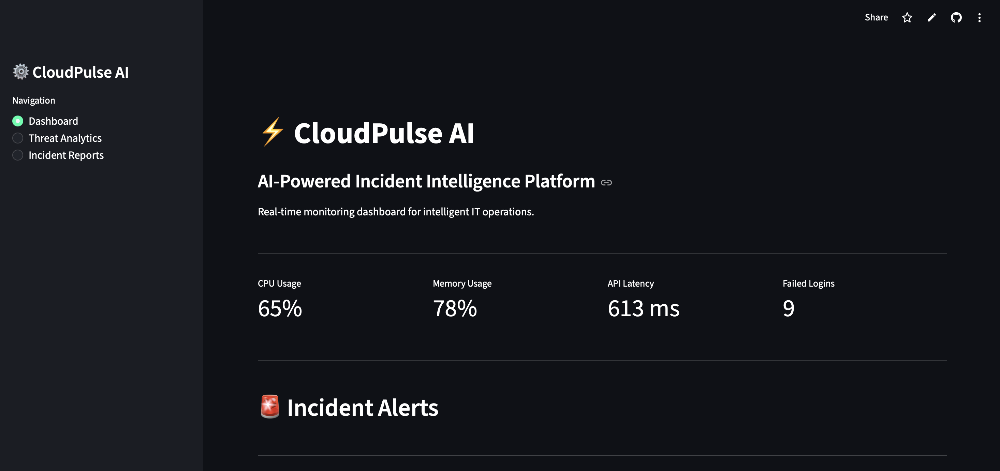
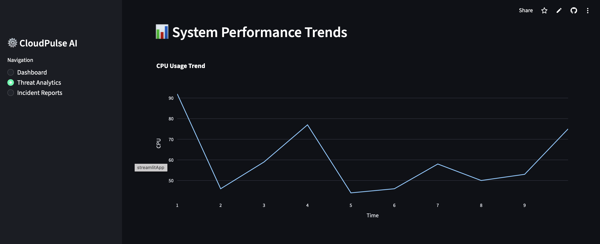
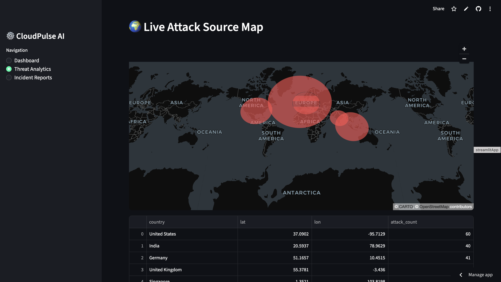
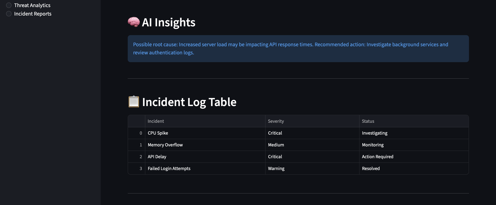
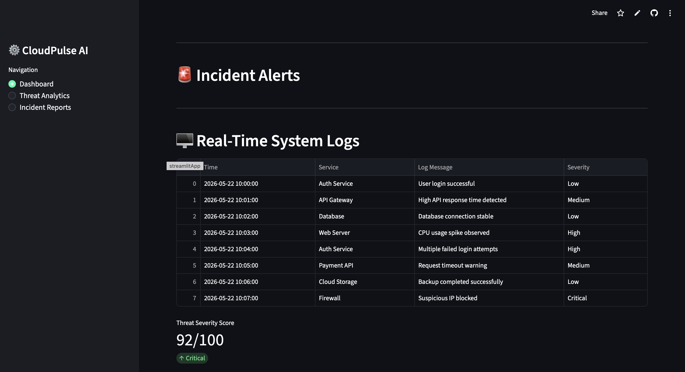

# ⚡ CloudPulse AI

AI-Powered Incident Intelligence & Threat Analytics Platform

CloudPulse AI is a real-time monitoring and operational intelligence dashboard designed to simulate how modern IT teams monitor infrastructure health, detect anomalies, analyze threats, and improve incident response workflows.

## 🚀 Live Demo

https://cloudpulse-ai-afzbzpyjc6ymzdwatq8a3c.streamlit.app

## 📌 Key Features

- Real-time monitoring dashboard
- AI-powered threat severity scoring
- AI anomaly detection
- Threat analytics dashboard
- Incident reporting system
- Multi-page enterprise UI
- Live attack source visualization
- Auto-refreshing operational metrics
- Cloud deployment using Streamlit Cloud

## 🛠 Technologies Used

- Python
- Streamlit
- Pandas
- Scikit-learn
- Plotly
- PyDeck
- Git & GitHub
- Streamlit Cloud

## 🧠 Project Purpose

CloudPulse AI was built to simulate how enterprise IT operations and security monitoring teams detect incidents, monitor system performance, analyze operational risks, and improve response workflows using AI-driven insights.

## 🌍 Real-World Applications

This type of system can be used in:

- Cloud Operations Monitoring
- SOC (Security Operations Center)
- Infrastructure Monitoring
- DevOps Monitoring
- Incident Management
- Operational Analytics

## 📷 Project Screenshots

### Dashboard

### Threat Analytics

### Live Attack Map

### Incident Reports

### AI Insights

### System Logs

## 💻 GitHub Repository

https://github.com/sahithi-kota11/CloudPulse-AI

## 👩‍💻 Developed By

Sahithi Kota  
Master’s in Information Systems  
Cleveland State University
